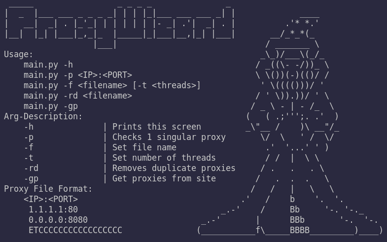
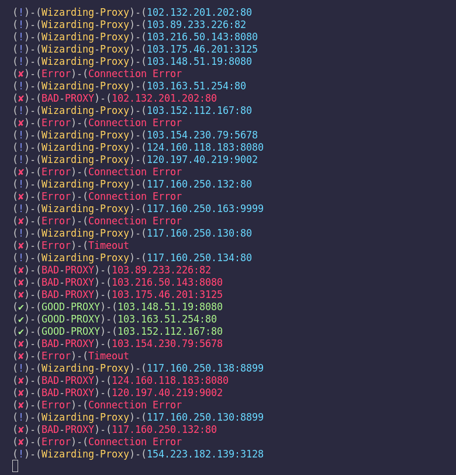
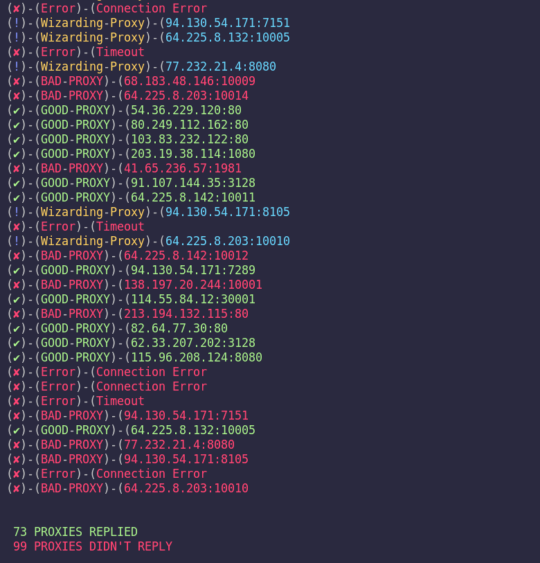
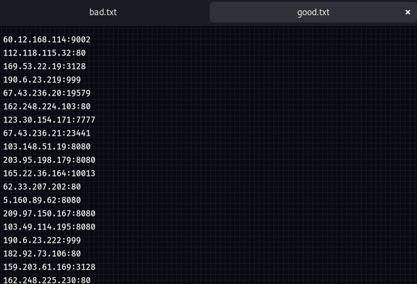

# ProxyWizard [](https://www.python.org/downloads/release)

## Images of Usage







## Description

ProxyWizard is a simple python3 script designed to check the status of HTTP proxy servers. It provides options for checking a single proxy, proxies both with and without threads, handling various errors, and displaying the results. There is also an added function to remove duplicate lines from a proxy file. ***Depending on output, the good and bad proxies will be sorted accordingly.***

## Prerequisites

Before running the script, ensure you have the following dependencies installed:

- Python 3.x
- `urllib3`  library: You can install it using `pip install urllib3`
- `requests` library: You can install it using `pip install requests`
- `colorama` library: You can install it using `pip install colorama`

## Usage

Running the Script
```bash
python3 ProxyWizard.py [options]

Command-line Options:

  --help or -h: Display the help screen.
  -f FILENAME: Specify the filename containing a list of proxies to check.
  -t NUM_THREADS: Specify the number of threads to use (applicable only with the -f option).
  -rd FILENAME: Remove duplicates from a file containing a list of proxies.
  -p PROXY: Check the status of a single proxy.
  -gp: Scrape HTTP proxies using the Proxyscrape API.
```
## Examples

Checking Proxies from a File

```bash
python3 ProxyWizard.py -f your_proxy_list.txt -t 5
```
## Removing Duplicates from a File
This will remove duplicate proxies from the file your_proxy_list.txt.

```bash
python3 ProxyWizard.py -rd your_proxy_list.txt
```

## Checking a Single Proxy
This will check the status of the proxy
```bash
python3 ProxyWizard.py -p
```

## Scraping HTTP Proxies

This will scrape HTTP proxies using the Proxyscrape API and save them to proxies.txt.
```bash
python3 ProxyWizard.py -gp
```

# License [](https://opensource.org/licenses/MIT)

This project is licensed under the `MIT` License.
